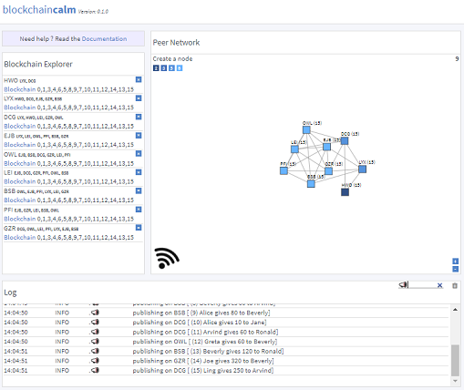

*Don't just know the blockchain, feel it.*

# [blockchaincalm](https://lorenzoongithub.github.io/blockchaincalm/) 

blockchaincalm is a web app for experimenting with blockchain technology from your computer/laptop (no great support for mobile devices).

It runs on any modern browser (Chrome, Firefox, IE edge).

## Issues

Report any issue (and any suggestion) using GitHub and use notifications to track progress on them.

## Contributing

Want to hack on this project? Any kind of contribution is welcome! 
But be patient. As of now, Summer 2018, this project is at its early days and it's going to take some time 
to take some shape  

## License

This project is licensed under the MIT license.
